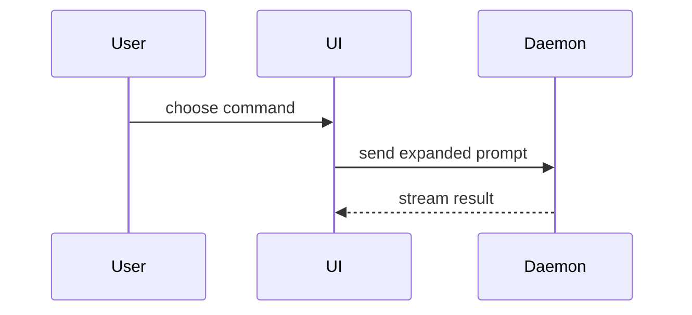

Help the user understand the current topic of conversation visually. Skip the preamble and keep prose brief. Pick the smallest view that makes the key point clear.

- Show logic or an algorithm as pseudocode:

```text
on(save)
  if content is unchanged
    return cached result
  write new content
  return fresh result
```

- Show runtime control flow as a call tree:

```text
submitForm
  createSession
    persistPrompt
    launchAgent
  navigateToSession
```

- Show UI structure as a component tree, including state and module boundaries that matter:

```tsx
<SessionPage> (apps/example/src/routes/session.tsx)
  useSessionEvents()
  <SessionToolbar>
    <RunSkillButton> (packages/ui)
```

- Show file responsibility or a broad refactor as a shallow file tree:

```text
src/
├── commands/       # parses user actions
├── sessions/       # owns session state
└── transport/      # sends API requests
```

- Show component interaction, control flow, or data flow with Mermaid:



- Use `diff` when the point is what changes and the surrounding shape already exists. Match the diff shape to the topic.

For a component change:

```diff
 <SessionPage>
   useSessionEvents()
   <SessionToolbar>
+    <RunSkillButton />
   <SessionTimeline>
+    <SkillResultCard />
```

For a file-layout change:

```diff
 src/
 ├── commands/
+│   └── show-me.ts       # expands the slash command
 ├── sessions/
-└── transport.ts
+└── transport/
+    ├── client.ts
+    └── stream.ts
```

For a call-tree or call-stack change:

```diff
 submitForm
   createSession
     persistPrompt
+    expandSkillMention
     launchAgent
-  navigateToSession
+  navigateToSession
+    subscribeToEvents
```

For a state or control-flow change:

```diff
 on(save)
-  write content
+  if content is unchanged
+    return cached result
+  write new content
+  invalidate cache
```

- Show the whole block when most of it is new, when omitted context would hide ownership or order, or when the user needs a copyable target shape:

```ts
function expandSkill(command: string): string {
  const skillName = command.slice(1)
  return `use the ${skillName} skill`
}
```

- For a visual UI, layout, state comparison, or concept too dense for Mermaid, write one focused HTML file — a diagram, an infographic, or a short slide deck, whichever fits the point. Match the product's colors, type, spacing, and components; use real labels and data; support desktop and mobile. Then open it for the user:

```
Bash(open path/to/show-me-{description}.html)
```

### guidance

Place each visual next to the short text it supports. Keep only the calls, files, props, states, and boundaries needed to answer the user's current question or the options to resolve the current discussion point.

You may use one of these, you may use several, it is unlikely you will use all of them. Use your judgement and don't overwhelm the user.

## Shared appearance assets

- New HTML defaults to both light and dark appearances, following the system without a theme switch. Author one DOM and one layout; copy existing assets rather than outputting duplicate palettes or markup.
- For explicit website/image recreation, first ask whether to preserve the original appearance or add system-following light/dark support, unless the user already answered. Follow that choice.
- Reuse the installed `html` skill's `design-system/theme.css` (resolve `../html/design-system/theme.css` relative to this installed skill's directory; install `html` alongside this skill): copy it next to the output under `design-system/` and link it. It supplies both palettes and minimal element defaults, without the document layout. If it is unavailable, report the missing dependency rather than silently producing light-only HTML.
- Use its semantic tokens for surfaces, text, borders, shadows, controls, code, and diagrams: `--mb-bg`, `--mb-surface`, `--mb-ink`, `--mb-ink-body`, `--mb-border`, `--mb-rule`, `--mb-muted`, `--mb-link`, `--mb-accent`, `--mb-code-bg`, and `--mb-series-1` through `--mb-series-4`. SVG uses `currentColor` or these variables. Keep original photos/screenshots unchanged, using a suitable frame where needed; do not apply blanket inversion.
- Only for Canvas/chart libraries, also copy/load `theme.js` from that directory. Register `MBTheme.watch(palette => { /* draw/update using palette values */ })` after the chart exists. It runs immediately and on system appearance changes; use `palette['series-1']`, `palette['ink']`, etc., not CSS-variable strings in Canvas APIs. The returned function unsubscribes. Reuse chart instances on redraw.
- Check the same page in light and dark appearances, including code, SVG/chart labels, controls, and runtime theme changes. Print remains light. Do not generate separate light/dark pages or a UI test project.
